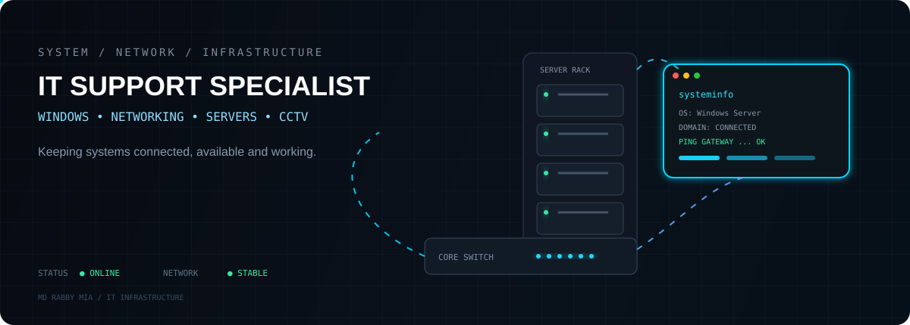

<div align="center">

# MD RABBY MIA

### IT Support Specialist · Windows System Administrator

**Windows Systems · Networking · Servers & Active Directory · CCTV**

<p>
  <a href="https://github.com/sajidrabby">
    
  </a>
  <a href="https://www.linkedin.com/in/sajidrabby">
    
  </a>
  <a href="https://sajidrabby.com">
    
  </a>
</p>

</div>



---

## `> system.info`

I work with **Windows systems, networks, servers, Active Directory, Microsoft 365, hardware, CCTV and IT infrastructure**.

My focus is simple: **keep systems available, connected and working.**

```text
LOCATION      Al Khobar, Eastern Province, Saudi Arabia
ROLE          IT Support Specialist / Windows System Administrator
FOCUS         Infrastructure · Networking · Windows · Servers · CCTV
CURRENT       Network Technician — Saudi Aramco Project
```

---

## `> technical.stack`

<table>
<tr>
<td width="50%" valign="top">

### 🖥 Windows & Systems

- Windows 10 / 11
- Windows Server
- Active Directory
- Group Policy
- DNS / DHCP
- Microsoft 365
- User & Permission Management
- System Troubleshooting

</td>
<td width="50%" valign="top">

### 🌐 Networking

- TCP/IP
- LAN / WAN
- VLAN
- Switches & Routers
- MikroTik
- Cisco
- Wi-Fi
- Structured Cabling
- Fiber Optics

</td>
</tr>
<tr>
<td width="50%" valign="top">

### 🗄 Servers & Data

- Server Hardware
- RAID
- SQL Server
- Backup & Storage
- NAS
- Hardware Monitoring
- Server Troubleshooting

</td>
<td width="50%" valign="top">

### 📹 Security & Infrastructure

- CCTV
- Hikvision
- NVR / DVR
- PoE
- IP Cameras
- VoIP / IP Systems
- Cabling & Testing
- Network Infrastructure

</td>
</tr>
</table>

---

## `> experience`

```text
2026 ───────────────────────────────────────────────►

Dubaib & Sulaim Co. (DSCO) — Network & Telecom Technician
Full-time · Apr 2026 – Present · Al Khobar, Saudi Arabia

• Install & configure switches, routers, and access points
• Support LAN/WAN network infrastructure for high uptime
• Troubleshoot and resolve network/connectivity issues
• Handle structured cabling (LAN & Fiber optic cabling)
• Assist with fiber cable pulling, testing, and connections
• Support telecom systems (PABX, Intercom, VoIP, telephone lines)
• Maintain CCTV and basic security system installations
• Perform routine checks and tracking of network equipment


2026 ───────────────────────────────────────────────►

Quick Zone Establishment — IT Support Specialist
Contract (Hybrid) · Mar 2026 – Present · Al Khobar, Saudi Arabia

• Provide daily IT & POS software support across branches
• Maintain company website and manage M365/business emails
• Setup, configure & troubleshoot PCs, printers, and scanners
• Support CCTV, network devices, and office IT infrastructure
• Conduct routine preventive maintenance & hardware checks
• Manage IT assets and coordinate with third-party vendors


2022 ─────────────────────────────── 2026

Fahad Supplies Supermarket — IT Support Specialist / IT Tech
Full-time · Jun 2022 – Apr 2026 · Dammam, Saudi Arabia

• Managed servers, Active Directory (100+ accounts), & networks
• Oversaw firewall management, SQL Server, and system backups
• Configured & maintained Point of Sale (POS) systems
• Supported head office and multi-branch network infrastructure
• Resolved hardware, software, LAN cabling, & Wi-Fi issues


2020 ─────────────────────────────── 2021

Incontrade Limited — Help Desk Technician
Internship · 2020 – 2021 · Chattogram, Bangladesh

• Provided on-site/remote support for PCs, laptops, & printers
• Troubleshot software/hardware issues to minimize downtime
• Managed local Wi-Fi performance and LAN configurations


2017 ─────────────────────────────── 2019

Chittagong Port Authority — Assistant Jetty Sarkar (C&F Agent)
Full-time · Oct 2017 – Nov 2019 · Chattogram, Bangladesh

• Coordinated export/import shipments and customs compliance
• Managed shipping documents (Invoices, Bills of Lading)
• Served as primary client contact for shipment tracking & reports
## `> featured.projects`

<table>
<tr>
<td width="50%" valign="top">

### 🌐 DSCO Website

Company website project with a modern responsive interface.

**HTML · CSS · JavaScript**

<a href="https://www.dsco.com.sa/">View Website →</a>

</td>
<td width="50%" valign="top">

### 🛠 IT Support Portfolio

My technical portfolio covering systems, networking, servers and infrastructure.

**HTML · CSS · JavaScript**

<a href="https://sajidrabby.com">View Portfolio →</a>

</td>
</tr>
</table>

---

## `> github.activity`

<div align="center">


<br>


</div>

---

## `> certifications`

```text
CCNA
CompTIA ITF+
CompTIA A+
CompTIA Network+
Microsoft Azure
Saudi Council of Engineers — Registered Member
```

---

## `> currently_learning`

```text
[■■■■■■■■■■] Windows Server & Active Directory
[■■■■■■■■■□] Networking & Infrastructure
[■■■■■■■■□ □] Python & Automation
[■■■■■■■□□□] Web Development
[■■■■■■■□□□] Cloud & Microsoft 365
```

---

## `> contact`

<div align="center">

**Open to IT Support · System Administration · Network Technician opportunities**

<br>

<a href="https://www.linkedin.com/in/sajidrabby">LinkedIn</a>
&nbsp; · &nbsp;
<a href="https://github.com/sajidrabby">GitHub</a>
&nbsp; · &nbsp;
<a href="https://sajidrabby.com">Portfolio</a>

<br><br>

```text
> ping sajidrabby
> connection established
> status: available for IT support work
```

</div>

---

<div align="center">

### `KEEP SYSTEMS RUNNING. KEEP PEOPLE WORKING.`


</div>
